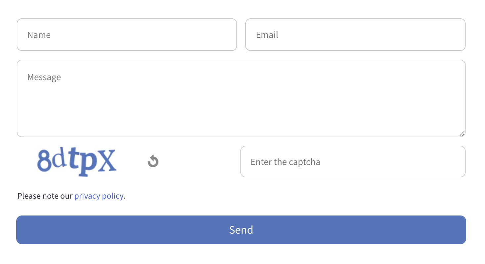

# Contact Form Block Plugin for Kirby Uniform

This plugin implements a contact form block using Martin Zurowietz' [
`kirby-uniform`](https://github.com/mzur/kirby-uniform) plugin for Kirby.
The block can be easly added to your blueprints and is fully configurable.

It comes with a simple captcha guard and a spam word guard to prevent spam submissions.
It also has the uniform honeypot and honeytime guards enabled by default.

The panel block allows adjustments of the labels of the form.

[](https://github.com/tearoom1/kirby-content-watch)

## Getting started

Use one of the following methods to install & use `tearoom1/uniform-contact-block`:

### Git submodule

If you know your way around Git, you can download this plugin as
a [submodule](https://github.com/blog/2104-working-with-submodules):

```text
git submodule add https://github.com/tearoom1/uniform-contact-block.git site/plugins/uniform-contact-block
```

### Composer

```text
composer require tearoom1/uniform-contact-block
```

### Clone or download

1. Clone or download this repository from github: https://github.com/tearoom1/uniform-contact-block.git
2. Unzip / Move the folder to `site/plugins`.

## Dependencies

- [Kirby](https://getkirby.com)
- [Kirby Uniform](https://github.com/mzur/kirby-uniform)
- [Uniform Simple Captcha](https://codeberg.org/refbw/uniform-simple-captcha)
- [Uniform Spam Words](https://github.com/tearoom1/uniform-spam-words)

> Note: Check the corresponding documentation for further information and required configuration.
> Specifically the uniform.honeytime guard from kirby-uniform is used and needs configuration in your `config.php`

## Multi language requirement

This plugin requires a Kirby multi-language setup. It uses routes that expect the language code as the first segment of
the URL.
It can easily be stripped down to a single language setup by removing the language code from the routes and a few
adjustments.

## Usage

Use the block by adding it to you blueprints fieldsets if they are defined:

```yaml
fieldsets:
  - uniform-contact
```

Add the javascript to all pages that use this block.
E.g. before the closing body tag in the `footer.php`

```php
<?php snippet('uniform-contact/js'); ?>
```

And in the `<head>` if you want to use the default css:

```php
<?php snippet('uniform-contact/css'); ?>
```

> Note: By default, the snippets always load the assets. See below for more details.

### Configuration

You may change certain options from your `config.php` globally:

```php
return [
    'tearoom1.uniform-contact-block' => [
        'enabled' => true, // default true
        'alwaysIncludeAssets' => true, // default true
        'fromEmail' => 'mail@example.org',
        'toEmail' => 'mail@example.org',
        'fromName' => 'My Name',
        'formBrowserValidate' => 'validate',
        'formNameRequired' => true,
        'formEmailRequired' => true,
        'formMessageRequired' => true,
        'formNamePattern' => '[^\s]{3,}',
        'formEmailPattern' => '[^\s@]+@[^\s@]+\.[^\s@]+',
    ],
    'uniform.honeytime' => [
        'key' => 'base64:your-key-here',
    ],

];
```

The option `alwaysIncludeAssets` determines whether the `uniform-contact/js` and `uniform-contact/css` snippets are
always printing the assets or only if the block is present on the page.
Determining the presence of the block is a little expensive logic and may
want to be avoided, depending on the setup.

For the honeytime encryption key: You can generate one with the command `head -c 32 /dev/urandom | base64` and then
append a base64: prefix.
See also https://kirby-uniform.readthedocs.io/en/latest/guards/honeytime/

And optional additional configuration for the included plugins. For example:

```php
    'simple-captcha' => [ // https://codeberg.org/refbw/uniform-simple-captcha
        'distort' => false,
        'interpolate' => false,
        'applyEffects' => false,
        'applyNoise' => false,
        'applyPostEffects' => false,
        'applyScatterEffect' => false,
        'textColor' => '#57a514',
        'bgColor' => '#fff',
        'width' => 200,
        'height' => 50,
    ],
    'tearoom1.uniform-spam-words' => [
        'spamThreshold' => 8,
        'spamWords' => [
            10 => ['my important spam word'],
        ],
    ]
```

## Styling

In case you are using the default stylesheet, you can adjust the styling.
It uses the following css variables that can be overwritten in your own stylesheet.

```css
--font-size-default
--font-size-big
--color-white
--color-accent
--color-error
--color-warning
--gap
```

## License

This plugin is licensed under the [MIT License](LICENSE), but **using Kirby in production** requires you
to [buy a license](https://getkirby.com/buy).

## Credits

- Developed by Mathis Koblin

[](https://coff.ee/tearoom1)
